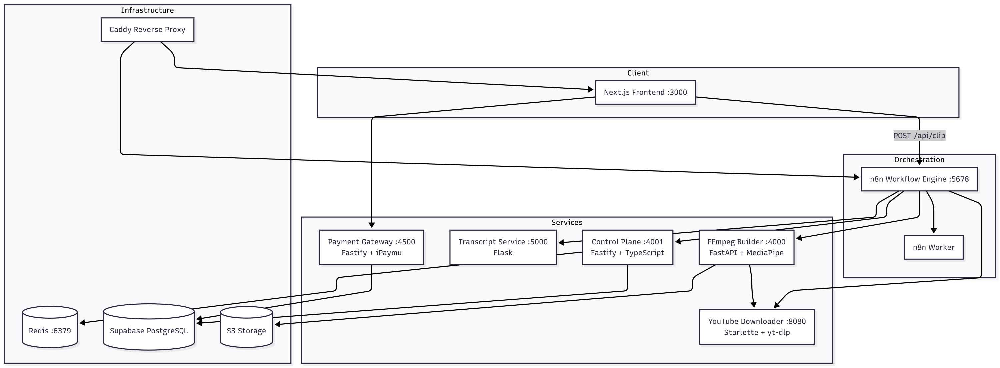

# YouClip: Production-Grade AI Video Repurposing Infrastructure

**The complete, microservices-based architecture for building high-performance AI video platforms. Save ~800 hours of R&D and launch your Opus Pro competitor on day one.**

## Overview
Building a stable, commercial AI video processing pipeline is an engineering nightmare. It involves solving complex hurdles in distributed media processing, real-time computer vision, and stateful orchestration. 

This repository documents the production-ready infrastructure used to handle these complexities. It is designed for engineers and founders who value **time-to-market** over reinventing the wheel.

## The Engineering Challenge (Solved)
YouClip eliminates the most difficult parts of building a video repurposing SaaS:

### 1. The Media Engine (Vision & Processing)
*   **Auto-Reframe (MediaPipe):** Integrated computer vision that tracks and centers speakers during 16:9 to 9:16 conversion. No more "shaky" or off-center crops.
*   **FFmpeg Orchestration:** Specialized FastAPI workers optimized for high-bitrate rendering. We've handled the memory management and process blocking issues so you don't have to.

### 2. Semantic Intelligence
*   **Gemini 2.5 Flash Integration:** Advanced LLM-based semantic scoring that actually understands "hooks" and "retention" rather than just cutting at random timestamps.
*   **Context-Aware Analysis:** Logic for processing long-form transcripts while maintaining conversational context for the AI scorer.

### 3. Distributed Microservices
*   **7 Orchestrated Services:** A modular architecture including a Control Plane (TypeScript), FFmpeg Builder (Python), and specialized services for Transcripts and Downloads.
*   **n8n Workflow Engine:** The entire business logic is decoupled from the code. This allows for real-time monitoring, visual debugging, and rapid iteration of the "Video Logic" without redeploying code.

## The Technical Stack
Verified production stack designed for scalability:
- **Frontend:** Next.js 16 (App Router), React 19, Tailwind CSS.
- **Orchestration:** Self-hosted n8n (Visual Workflow Engine).
- **Core Engine:** Python 3.11, FastAPI, FFmpeg, MediaPipe.
- **Microservices:** Fastify (TypeScript), Starlette, Flask.
- **Database & Cache:** Supabase (PostgreSQL), Redis 7.4.

## Commercial License & Full Source Code
This repository serves as a technical overview. For $29, you can skip months of development and get access to the **Full Production Blueprint**.

**What's included in the kit:**
1.  **Full Platform Frontend** (Next.js 16 Dashboard).
2.  **FFmpeg Rendering Engine** (Python API).
3.  **Control Plane Service** (TypeScript/Fastify).
4.  **n8n Workflow JSONs** (The Brain).
5.  **YouTube Downloader & Transcript Services.**
6.  **Integrated iPaymu Payment Gateway.**
7.  **Complete Docker Compose Setup.**

### [ 👉 ACQUIRE THE FULL SOURCE CODE HERE ]
**Official Site: [https://purchase.youclip.id/](https://purchase.youclip.id/)**

---

### Technical Keywords (SEO)
`Opus Pro Clone Source Code` | `AI Video Clipper SaaS Starter Kit` | `YouTube to Shorts Generator Architecture` | `MediaPipe Face-Tracking FFmpeg` | `AI Video Automation Infrastructure` | `Self-Hosted AI Video Repurposing`

*Developed for engineers who value precision and performance.*
